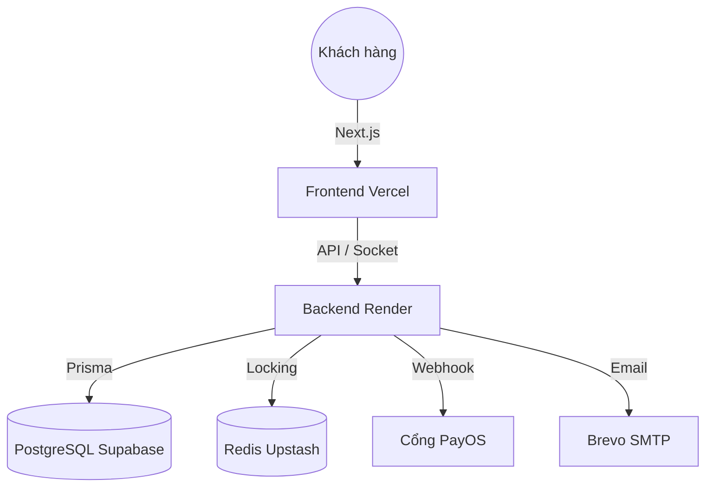

# 🏸 NOVA Booking — Hệ Thống Quản Lý Đặt Sân Cầu Lông Cao Cấp

> **Giải pháp quản trị sân thể thao toàn diện**: Đặt sân thời gian thực, giữ chỗ thông minh bằng Redis, thanh toán tự động qua PayOS và báo cáo thống kê chuyên sâu.

NOVA Booking là nền tảng Full-stack được thiết kế chuẩn Production dành cho chủ sân và người chơi. Hệ thống kết hợp khả năng đồng bộ trạng thái tức thời, cơ chế chống đặt trùng slot (Double-booking) mạnh mẽ, và quy trình xử lý hoàn tiền minh bạch.


---

## 📌 Mục Lục

- [1. Tính Năng Nổi Bật](#1-tính-năng-nổi-bật)
- [2. Công Nghệ Sử Dụng](#2-công-nghệ-sử-dụng)
- [3. Kiến Trúc Hệ Thống](#3-kiến-trúc-hệ-thống)
- [4. Quy Trình Đặt Sân & Thanh Toán](#4-quy-trình-đặt-sân--thanh-toán)
- [5. Cấu Trúc Thư Mục](#5-cấu-trúc-thư-mục)
- [6. Hướng Dẫn Cài Đặt (Local)](#6-hướng-dẫn-cài-đặt-local)
- [7. Biến Môi Trường (Environment Variables)](#7-biến-môi-trường-environment-variables)
- [8. Triển Khai Production (Render/Vercel)](#8-triển-khai-production-rendervercel)

---

## 🌟 1. Tính Năng Nổi Bật

### ⚡ Thời Gian Thực (Real-time)
- Sử dụng **Socket.io** để đồng bộ hóa trạng thái sân ngay lập tức trên mọi thiết bị.
- Khi một slot được chọn, khóa tạm thời hoặc hủy bỏ, tất cả khách hàng khác sẽ thấy thay đổi ngay mà không cần tải lại trang.

### 🔒 Chống Đặt Trùng Với Redis Lock
- Cơ chế **Atomic Lock** 10 phút: Khi khách hàng bắt đầu thanh toán, slot sẽ được khóa trên Redis để ngăn người khác xen ngang.
- Tự động giải phóng khóa nếu khách hàng hủy thanh toán hoặc quá 10 phút không hoàn tất.

### 💸 Thanh Toán & Hoàn Tiền Tự Động
- Tích hợp cổng **PayOS** (VietQR): Quét mã trả tiền, hệ thống xác nhận đơn ngay lập tức qua Webhook.
- Quy trình **Hoàn tiền thông minh**: Hỗ trợ Admin duyệt hoàn tiền cho các đơn bị hủy do bảo trì hoặc lý do bất khả kháng.

### 📊 Báo Cáo Thống Kê Chuyên Sâu
- Dashboard dành cho Admin với các chỉ số: Doanh thu, Tỷ lệ lấp đầy, **Tỷ lệ hủy thực tế** (chỉ tính trên các đơn đã trả tiền), VIP Customers và Khung giờ vàng.

### 🛠 Quản Trị Sân Toàn Diện
- CRUD sân vận động: Hình ảnh (Cloudinary), tiện ích, bảng giá theo giờ.
- **Tính năng bảo trì**: Khóa sân và tự động hủy + thông báo email cho khách hàng đã đặt trong khung giờ đó.

---

## 💻 2. Công Nghệ Sử Dụng

| Thành phần | Công nghệ chính |
|------------|-----------------|
| **Frontend** | Next.js 15 (App Router), Tailwind CSS, TanStack Query, Socket.io Client |
| **Backend** | NestJS, TypeScript, Prisma ORM, BullMQ (Queue) |
| **Dữ liệu** | PostgreSQL (Supabase), Redis (Upstash) |
| **Dịch vụ ngoài** | PayOS (Thanh toán), Cloudinary (Ảnh), Brevo/Gmail (Email Marketing) |
| **DevOps** | Docker Compose, GitHub Actions (CI/CD) |

---

## 🏗 3. Kiến Trúc Hệ Thống

NOVA Booking được xây dựng theo mô hình hướng dịch vụ (Service-oriented), tách biệt rõ ràng giữa logic nghiệp vụ và hạ tầng:



---

## 🔄 4. Quy Trình Đặt Sân & Thanh Toán

1. **Chọn Slot**: Khách hàng chọn sân và khung giờ. Hệ thống check DB và Redis để đảm bảo slot còn trống.
2. **Khóa Tạm**: Khi bấm "Đặt sân", Backend tạo một khóa tạm trên Redis (10p) và sinh link thanh toán PayOS.
3. **Thanh Toán**: Khách hàng quét mã QR.
4. **Xác Nhận (Webhook)**: PayOS gửi tín hiệu về Backend -> Backend thực hiện **Prisma Transaction** để tạo đơn hàng + bản ghi thanh toán một cách nguyên tử.
5. **Hoàn Tất**: Giải phóng Redis lock và thông báo Real-time cho toàn hệ thống.

---

## 📂 5. Cấu Trúc Thư Mục

```text
NOVA_booking/
├── frontend/                 # Next.js - Client & Admin UI
│   ├── src/app/              # Routes & Pages
│   ├── src/components/       # UI Components (shadcn)
│   └── src/services/         # API & Socket logic
├── nova-booking-backend/     # NestJS - Server logic
│   ├── src/booking/          # Core logic đặt sân
│   ├── src/payment/          # Xử lý PayOS Webhook
│   └── prisma/               # Schema & Migrations
└── docker-compose.yml        # Chạy Local (DB & Redis)
```

---

## 🚀 6. Hướng Dẫn Cài Đặt (Local)

1. **Clone dự án**:
   ```bash
   git clone https://github.com/TruongDev24/nova-booking.git
   ```
2. **Chạy hạ tầng**:
   ```bash
   docker-compose up -d  # Khởi động Postgres & Redis
   ```
3. **Cấu hình Backend**:
   - `cd nova-booking-backend`
   - `npm install`
   - Tạo file `.env` từ `.env.example`.
   - `npx prisma db push`
   - `npm run start:dev`
4. **Cấu hình Frontend**:
   - `cd ../frontend`
   - `npm install`
   - Tạo file `.env.local` từ `.env.local.example`.
   - `npm run dev`

---

## 🌍 7. Triển Khai Production (Render/Vercel)

### Cấu hình Backend (Render)
- **Database**: Sử dụng Supabase PostgreSQL (Nhớ thêm `?pgbouncer=true` vào URL).
- **Redis**: Sử dụng Upstash (Bắt buộc dùng giao thức `rediss://` để hỗ trợ TLS).
- **Environment**: Thiết lập các biến `PAYOS_*`, `CLOUDINARY_*`, `SMTP_*`.

### Cấu hình Frontend (Vercel)
- Trỏ `NEXT_PUBLIC_API_URL` về địa chỉ của Render.

---

## 📄 8. API Documentation
Truy cập tài liệu Swagger UI tại địa chỉ:
`http://localhost:3001/api` (hoặc URL production của bạn).

---
*Phát triển bởi đội ngũ NOVA Booking - 2026.*
