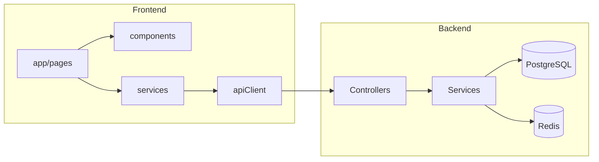

# Báo Cáo Cấu Trúc Mã Nguồn — NOVA Booking

Tài liệu mô tả cấu trúc monorepo **NOVA Booking**: Frontend Next.js 16 (App Router) và Backend NestJS 11 + Prisma/PostgreSQL. Cập nhật sau đợt tái cấu trúc thư mục và chuẩn hóa import.

---

## Tổng quan kiến trúc

```
NOVA_booking/
├── frontend/                 # Next.js — giao diện người dùng, admin, realtime
├── nova-booking-backend/     # NestJS — REST API, WebSocket, PayOS, Redis
├── docker-compose.yml        # Orchestration local (Postgres, Redis, services)
├── database_architecture.md  # Tài liệu schema DB
├── codebase_report.md        # File này
└── README.md                 # Hướng dẫn dự án
```

| Thành phần | Vai trò |
|------------|---------|
| **Frontend** | Đặt sân, thanh toán PayOS, dashboard admin, Socket.io client |
| **Backend** | JWT auth, booking, payment webhook, analytics, Cloudinary upload |
| **Redis** | Khóa slot, đơn tạm, idempotency webhook (không nằm trong repo schema) |
| **PostgreSQL** | Dữ liệu bền vững qua Prisma |

---

## Cây thư mục & giải thích

### Gốc dự án (`/`)

| Path | Mô tả |
|------|--------|
| `.github/workflows/` | CI/CD: build, test, deploy pipeline GitHub Actions. |
| `docker-compose.yml` | Khởi chạy stack dev/prod: backend, frontend, Postgres, Redis. |
| `.env.production.template` | Mẫu biến môi trường production (không chứa secret thật). |
| `database_architecture.md` | ERD, mô tả bảng, luồng booking/payment. |
| `README.md` | Onboarding, tech stack, env vars, API overview. |

---

### Frontend (`frontend/`)

#### Cấu hình & tooling

| Path | Mô tả |
|------|--------|
| `package.json` | Scripts `dev`, `build`, `start`; dependencies React 19, Next 16, TanStack Query. |
| `next.config.ts` | `standalone` output, domain ảnh Cloudinary/Unsplash. |
| `tsconfig.json` | Alias `@/*` → `src/*`. |
| `components.json` | Cấu hình shadcn/ui (aliases, Tailwind). |
| `eslint.config.mjs` | ESLint với preset Next.js. |
| `postcss.config.mjs` | PostCSS cho Tailwind v4. |
| `Dockerfile` / `Dockerfile.prod` | Image dev và production. |
| `AGENTS.md` / `CLAUDE.md` | Quy tắc agent cho Next.js 16. |
| `public/` | Static assets (hiện chỉ `.gitkeep`). |

#### `frontend/src/` — mã nguồn chính

| Path | Mô tả |
|------|--------|
| `middleware.ts` | Bảo vệ route `/admin/*`, `/user/*`; redirect nếu thiếu cookie `access_token`. |

##### `src/app/` — App Router (chỉ route, layout, page)

| Path | Mô tả |
|------|--------|
| `app/layout.tsx` | Root layout: font, Tooltip, Sonner, QueryProvider, SocketProvider. |
| `app/page.tsx` | `/` redirect → `/user`. |
| `app/globals.css` | Theme Tailwind/shadcn toàn cục. |
| `app/favicon.ico` | Icon tab trình duyệt. |

**`(auth)/`** — Route group đăng nhập (không có segment URL):

| Path | Mô tả |
|------|--------|
| `login/page.tsx` | Form đăng nhập, set cookie JWT, redirect theo role. |
| `register/page.tsx` | Đăng ký người chơi. |
| `reset-password/page.tsx` | Đặt lại mật khẩu qua token email. |
| `admin/register/page.tsx` | Đăng ký tài khoản admin. |

**`(dashboard)/`** — Khu vực sau đăng nhập:

| Path | Mô tả |
|------|--------|
| `layout.tsx` | Bọc `DashboardLayout` (sidebar, breadcrumb). |
| `admin/layout.tsx` | Gắn `AdminSocketListener` cho realtime admin. |
| `admin/page.tsx` | Dashboard KPI, biểu đồ giờ cao điểm, bảng VIP. |
| `admin/bookings/page.tsx` | Quản lý đơn đặt, refund, trạng thái. |
| `admin/courts/page.tsx` | CRUD sân, upload ảnh. |
| `admin/profile/page.tsx` | Trang profile admin (dùng `ProfileView`). |
| `user/layout.tsx` | Gắn `UserSocketListener` cho thông báo user. |
| `user/page.tsx` | Trang chủ user: duyệt/tìm sân. |
| `user/courts/page.tsx` | Danh sách sân phân trang. |
| `user/courts/[id]/page.tsx` | Chi tiết sân, chọn slot, tạo booking + PayOS. |
| `user/bookings/page.tsx` | Lịch sử đặt, thanh toán, review. |
| `user/bookings/payment-success/page.tsx` | UI sau thanh toán thành công. |
| `user/bookings/payment-cancel/page.tsx` | UI khi hủy thanh toán. |
| `user/profile/page.tsx` | Hồ sơ & đổi mật khẩu. |
| `user/profile/bank/page.tsx` | Form thông tin ngân hàng (hoàn tiền). |

##### `src/components/` — UI tái sử dụng

| Path | Mô tả |
|------|--------|
| `layouts/dashboard-layout.tsx` | Shell sidebar, nav theo role, logout. |
| `profile/profile-view.tsx` | Form profile + đổi mật khẩu dùng chung admin/user. |
| `providers/query-provider.tsx` | TanStack Query client + devtools. |
| `providers/socket-provider.tsx` | Socket.io context, kết nối JWT từ cookie. |
| `reviews/ReviewDialog.tsx` | Modal gửi đánh giá sân. |
| `admin/admin-socket-listener.tsx` | Lắng nghe `new_booking`, toast + invalidate cache. |
| `admin/peak-hours-chart.tsx` | Biểu đồ Recharts giờ cao điểm. |
| `admin/vip-customers-table.tsx` | Bảng khách VIP từ analytics. |
| `user/user-socket-listener.tsx` | Realtime cho user (slot, payment events). |
| `courts/court-card.tsx` | Card hiển thị sân trong danh sách. |
| `data-table/data-table.tsx` | Bảng TanStack Table có search, pagination. |
| `ui/*` | **Chỉ** primitive shadcn (button, card, dialog, table, …). |

##### `src/hooks/`, `src/lib/`, `src/services/`, `src/types/`

| Path | Mô tả |
|------|--------|
| `hooks/use-mobile.ts` | Breakpoint mobile cho sidebar. |
| `hooks/use-socket.ts` | Hook đọc `SocketContext`. |
| `lib/utils.ts` | `cn()` — clsx + tailwind-merge. |
| `lib/date-format.ts` | `formatToVietnamDate()` — timezone VN. |
| `lib/coming-soon.ts` | Handler + toast cho tính năng chưa làm. |
| `services/apiClient.ts` | Axios instance, header JWT, redirect 401. |
| `services/auth.service.ts` | API đổi mật khẩu, forgot/reset. |
| `services/booking.service.ts` | Slots, tạo booking, hủy, admin actions. |
| `services/court.service.ts` | CRUD sân. |
| `services/payment.service.ts` | Tạo link thanh toán. |
| `services/user.service.ts` | Profile, thông tin ngân hàng. |
| `services/analytics.service.ts` | API dashboard admin. |
| `types/analytics.ts` | Interface DTO analytics. |

---

### Backend (`nova-booking-backend/`)

#### Cấu hình & Prisma

| Path | Mô tả |
|------|--------|
| `package.json` | Scripts Nest, Jest, Prisma generate/deploy. |
| `nest-cli.json` | Cấu hình Nest CLI build. |
| `tsconfig.json` / `tsconfig.build.json` | TypeScript compile options. |
| `prisma/schema.prisma` | Model User, Court, Booking, Payment, Review + enum. |
| `prisma/migrations/` | Lịch sử migration SQL. |
| `prisma.config.ts` | Cấu hình Prisma 7 datasource. |
| `.env.example` | Mẫu env: DB, JWT, PayOS, Redis, Mail, Cloudinary. |
| `Dockerfile` / `Dockerfile.prod` | Container backend. |

#### `src/` — NestJS modules

| Path | Mô tả |
|------|--------|
| `main.ts` | Bootstrap: CORS, ValidationPipe, Swagger, global filter. |
| `app.module.ts` | Root module: Config, Schedule, Bull, Mailer, feature imports. |

**Feature modules** (mỗi module: `*.module.ts`, `*.controller.ts`, `*.service.ts`, `dto/`):

| Module | Mô tả |
|--------|--------|
| `auth/` | Đăng ký, login JWT, reset password; guards JWT + roles. |
| `users/` | Cập nhật profile, thông tin ngân hàng, proxy VietQR. |
| `court/` | CRUD sân, upload Cloudinary, email thông báo. |
| `booking/` | Slot availability, tạo đơn, Redis lock, admin booking. |
| `booking/booking.cron.ts` | Cron auto-complete booking đã qua giờ chơi. |
| `booking/processors/booking-expiration.processor.ts` | BullMQ worker hết hạn PENDING (chưa đăng ký module). |
| `payment/` | PayOS webhook, fulfill booking transaction. |
| `review/` | Tạo/list review theo sân. |
| `analytics/` | Thống kê doanh thu, peak hours, VIP cho admin. |
| `notification/` | Socket.io gateway realtime (`@Global`). |
| `prisma/` | Prisma client wrapper (`@Global`). |
| `redis/` | ioredis helpers (`@Global`). |
| `cloudinary/` | Upload ảnh sân. |

**`src/common/`** — Cross-cutting (không phải Nest module):

| Path | Mô tả |
|------|--------|
| `decorators/get-user.decorator.ts` | `@GetUser()` lấy JWT payload từ request. |
| `decorators/public.decorator.ts` | `@Public()` bỏ qua JWT guard. |
| `decorators/roles.decorator.ts` | `@Roles(...)` metadata phân quyền. |
| `validators/is-future-or-today.validator.ts` | class-validator: ngày đặt ≥ hôm nay (VN). |
| `dto/pagination-query.dto.ts` | Query `page`, `limit` dùng chung. |
| `filters/http-exception.filter.ts` | Global exception → JSON. |
| `interfaces/user-payload.interface.ts` | Kiểu `request.user` từ JWT. |

#### `test/` — Unit tests (Jest)

| Path | Mô tả |
|------|--------|
| `test/auth/` | AuthService, DTO login/register. |
| `test/booking/` | BookingService. |
| `test/court/` | Court controller + service. |
| `test/payment/` | PayOS webhook. |
| `test/review/` | ReviewService. |

---

## Sơ đồ phụ thuộc logic (tóm tắt)



---

## Misplaced Files (Các file đặt sai vị trí)

Danh sách dưới đây ghi **vị trí cũ → vị trí mới** đã được áp dụng trong đợt tái cấu trúc.

### Frontend

| Vị trí cũ (sai) | Vị trí mới (chuẩn) | Lý do |
|-----------------|-------------------|--------|
| `app/(dashboard)/admin/components/AdminSocketListener.tsx` | `components/admin/admin-socket-listener.tsx` | Component nghiệp vụ không nên nằm trong `app/` |
| `app/(dashboard)/admin/components/PeakHoursChart.tsx` | `components/admin/peak-hours-chart.tsx` | Chart feature tách khỏi route tree |
| `app/(dashboard)/admin/components/VipCustomersTable.tsx` | `components/admin/vip-customers-table.tsx` | Table feature tách khỏi route tree |
| `app/(dashboard)/user/components/UserSocketListener.tsx` | `components/user/user-socket-listener.tsx` | Đồng nhất với admin listener |
| `components/ui/court-card.tsx` | `components/courts/court-card.tsx` | `ui/` chỉ dành cho shadcn primitives |
| `components/ui/data-table.tsx` | `components/data-table/data-table.tsx` | Composite table, không phải primitive |
| `utils/date-format.ts` | `lib/date-format.ts` | Gom helper vào `lib/` (cùng `cn()`) |
| `utils/coming-soon.ts` | `lib/coming-soon.ts` | Gom helper vào `lib/` |
| `hooks/useSocket.tsx` (Provider + hook) | `components/providers/socket-provider.tsx` + `hooks/use-socket.ts` | Provider không thuộc `hooks/` |

### Backend

| Vị trí cũ (sai) | Vị trí mới (chuẩn) | Lý do |
|-----------------|-------------------|--------|
| `auth/decorators/public.decorator.ts` | `common/decorators/public.decorator.ts` | Decorator dùng cross-module (payment, booking) |
| `auth/decorators/roles.decorator.ts` | `common/decorators/roles.decorator.ts` | Decorator dùng cross-module |
| `common/decorators/is-future-or-today.decorator.ts` | `common/validators/is-future-or-today.validator.ts` | File là class-validator constraint, không phải Nest decorator |
| `auth/auth.service.spec.ts` | **Đã xóa** (giữ bản `test/auth/auth.service.spec.ts`) | Spec không nằm trong `src/` |
| `booking/booking-expiration.processor.ts` | `booking/processors/booking-expiration.processor.ts` | Tách processor BullMQ khỏi service layer |

### Chưa di chuyển (đề xuất tương lai, không chặn build)

| File / pattern | Ghi chú |
|----------------|---------|
| Các `page.tsx` 350–600 dòng | Nên tách thành `components/{auth,admin,user}/` hoặc `_components/` colocated |
| `booking-expiration.processor.ts` | Đã move folder nhưng **chưa** `providers` trong `BookingModule` + chưa `BullModule.registerQueue` |
| `auth/guards/*.ts` | Có thể chuyển `common/guards/` nếu muốn tách hoàn toàn khỏi auth module |
| Auth pages dùng raw `axios` | Nên thống nhất qua `auth.service` / `apiClient` |

---

## Kết quả kiểm tra build

| Package | Lệnh | Kết quả |
|---------|------|---------|
| Frontend | `cd frontend && npm run build` | **Thành công** |
| Backend | `cd nova-booking-backend && npm run build` | **Thành công** |

---

## Quy ước thư mục sau tái cấu trúc

**Frontend**

```
src/
  app/           → page.tsx, layout.tsx only
  components/
    ui/          → shadcn primitives
    admin/ user/ courts/ data-table/ reviews/ layouts/ providers/ profile/
  hooks/         → React hooks only
  lib/           → utilities (cn, date-format, coming-soon)
  services/      → API clients
  types/         → shared TypeScript types
```

**Backend**

```
src/
  {feature}/     → module, controller, service, dto/
  common/
    decorators/  → Nest decorators + param decorators
    validators/  → class-validator constraints
    dto/ filters/ interfaces/
  test/          → *.spec.ts (mirror feature structure)
```

---

*Tài liệu được tạo tự động từ quét cấu trúc dự án. Tham chiếu thêm: `database_architecture.md`, `README.md`.*
