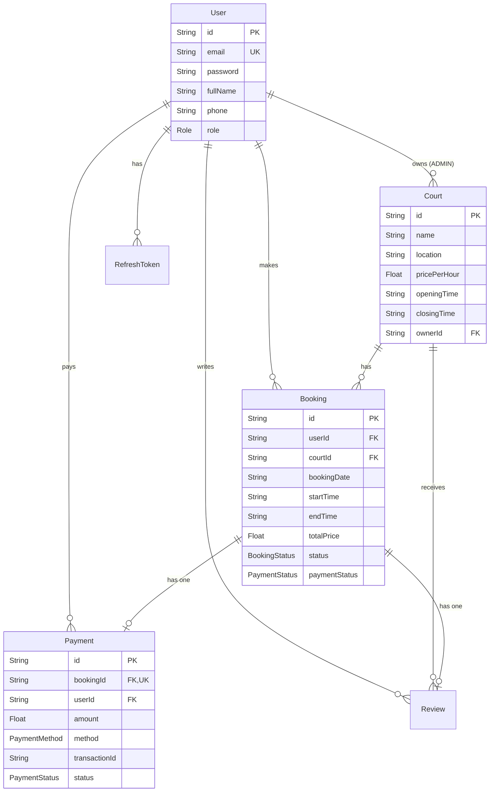

# Kiến Trúc Cơ Sở Dữ Liệu (Database Architecture)

Tài liệu này mô tả chi tiết cấu trúc CSDL của NOVA Booking (PostgreSQL qua Prisma/Supabase), cùng với các chiến lược nâng cao như Redis Atomic Lock, Indexing, Soft Delete và Database Transactions.

## 1. Sơ Đồ Thực Thể Kết Hợp (ERD)

Mô hình dữ liệu được thiết kế tập trung vào tính toàn vẹn của giao dịch (đặt sân và thanh toán).



---

## 2. Thiết Kế Redis Key (Atomic Lock)

Để giải quyết triệt để bài toán "Double-booking" (hai người cùng đặt một sân ở cùng một thời điểm), hệ thống sử dụng **Redis Atomic Lock** thay vì dùng cơ chế khóa cấp CSDL (Table/Row lock) nhằm tối ưu tốc độ và tránh thắt cổ chai hiệu năng.

### Cấu trúc khóa (Key Design)
- **Key Pattern**: `booking_lock:{courtId}:{date}:{startTime}` (Ví dụ: `booking_lock:abc-123:2026-05-20:14:00`).
- **Data Type**: `String` (Lưu trạng thái "processing").
- **TTL (Thời gian sống)**: `600` giây (Tương đương với 10 phút vàng để khách hàng quét mã QR).

### Luồng xử lý khóa
1. Khi User A chọn slot, Backend dùng lệnh `SETNX` (Set if Not eXists) để tạo key.
2. Nếu lệnh thành công, User A được giữ chỗ trong 10 phút để thanh toán PayOS.
3. Nếu User B cũng bấm chọn trùng slot, `SETNX` trả về 0 -> Hệ thống chủ động chặn lại và báo lỗi "Slot đang có người giữ".
4. Khóa này sẽ bị hủy bỏ (`DEL`) ngay lập tức khi thanh toán thành công, hoặc tự động bốc hơi (Expire) sau 10 phút nếu User A không thanh toán.

---

## 3. Chiến Lược Đánh Chỉ Mục (Indexing Strategy)

Để đảm bảo tốc độ truy vấn luôn siêu tốc kể cả khi dữ liệu phình to, Prisma schema sử dụng thuộc tính `@@index` tại các trường thường xuyên phải thực hiện logic truy vấn (WHERE) và sắp xếp (ORDER BY):

- **Bảng `Booking`**:
  - `@@index([courtId, bookingDate, startTime])`: Index siêu quan trọng để tối ưu hóa API sinh slot hiển thị rảnh/bận theo từng ngày của sân.
  - `@@index([status, bookingDate])`: Tối ưu hóa API xuất báo cáo và vẽ biểu đồ doanh thu trên Dashboard.
  - `@@index([payosOrderCode])`: Tối ưu hóa việc tìm kiếm đơn hàng cực nhanh khi Webhook từ cổng PayOS gọi về.
- **Bảng `Payment`**: Đánh chỉ mục tại `@@index([bookingId])` và `@@index([userId, status])`.

---

## 4. Chiến Lược Xóa Mềm (Soft Delete Strategy)

Hệ thống **TUYỆT ĐỐI KHÔNG** xóa vật lý (Hard Delete) các dữ liệu tài nguyên lõi như Sân (`Court`) hay Người dùng (`User`).
- **Thực thi**: Bảng `Court` chứa cờ `isDeleted: Boolean @default(false)`.
- **Nguyên nhân**: Khi một chủ sân muốn đóng cửa hoặc hủy bỏ một sân, nếu thực hiện xóa vật lý (Hard Delete), toàn bộ lịch sử các `Booking` và biên lai `Payment` liên kết khóa ngoại với sân đó sẽ bị xóa mất hoặc gây sập toàn vẹn dữ liệu. Cơ chế xóa mềm (`isDeleted = true`) giúp bảo tồn 100% lịch sử giao dịch để phục vụ đối soát kế toán, đồng thời làm sân đó "tàng hình" khỏi giao diện người chơi mới.

---

## 5. Giao Dịch CSDL (Database Transactions)

Để tránh hiện tượng sai lệch dữ liệu (Data Inconsistency) khi có lỗi đường truyền mạng hoặc crash phần cứng, Backend sử dụng cơ chế `this.prisma.$transaction(...)` bao bọc các thao tác cốt lõi:
- **Nguyên lý nguyên tử (Atomic Fulfillment)**: Khi Webhook PayOS xác nhận đã nhận tiền, hệ thống phải thực hiện 2 việc CÙNG MỘT LÚC: Update trạng thái `Booking.status = CONFIRMED` và tạo mới một bản ghi `Payment`.
- Nếu có một lỗi bất kỳ xảy ra trong cụm này, toàn bộ khối lệnh sẽ bị **Rollback** (quay ngược lại trạng thái ban đầu), chặn đứng tuyệt đối rủi ro "Đơn đặt sân đã chốt nhưng lại mất bản ghi dòng tiền thanh toán".

---

## 6. Các Lệnh Quản Trị Cơ Sở Dữ Liệu (Prisma)

Hệ thống sử dụng Prisma làm ORM. Dưới đây là các lệnh DevOps thông dụng:

**Cập nhật schema vào Database và tạo file Migration:**
```bash
npx prisma migrate dev --name init
```

**Đẩy schema trực tiếp (Không tạo lịch sử Migration - Rất hữu ích lúc Dev):**
```bash
npx prisma db push
```

**Sinh lại toàn bộ Client Type sau khi sửa file schema.prisma:**
```bash
npx prisma generate
```

**Chạy Seed (Đổ dữ liệu mẫu ban đầu):**
```bash
npx prisma db seed
```
