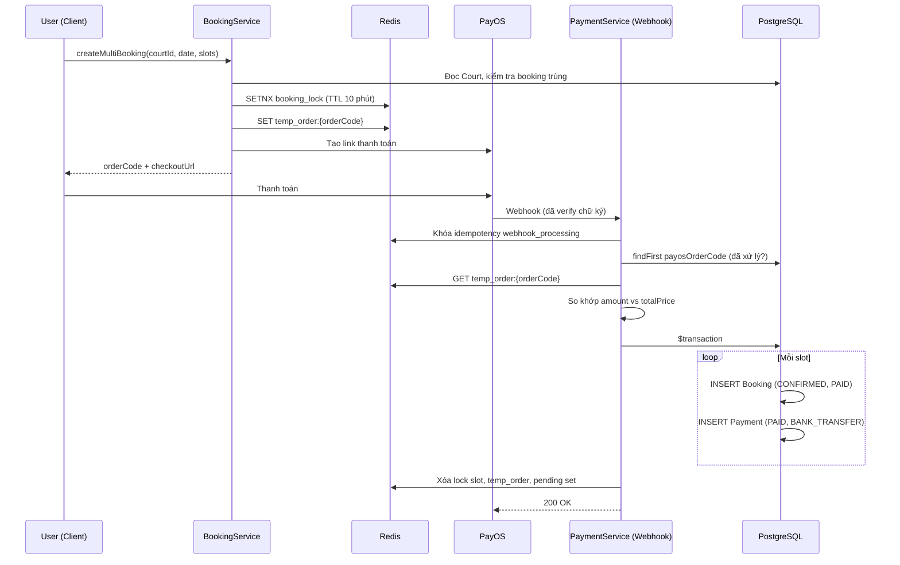
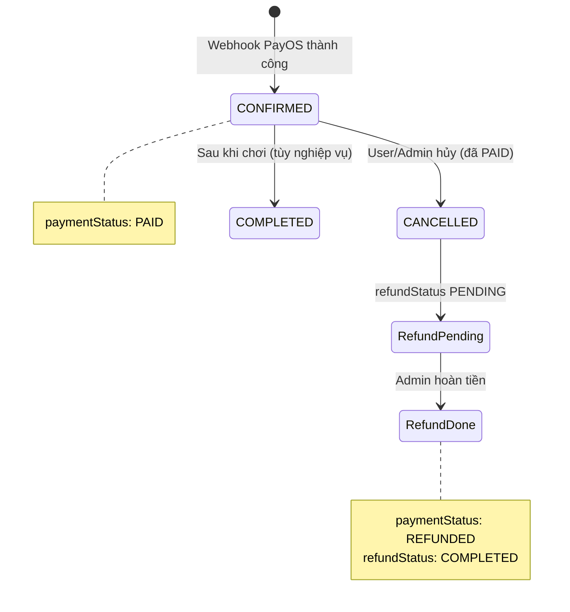

# Kiến trúc Cơ sở dữ liệu — NOVA Booking

Tài liệu này mô tả schema PostgreSQL của dự án **NOVA Booking**, được quản lý qua **Prisma** (`nova-booking-backend/prisma/schema.prisma`). Nguồn sự thật (source of truth) cho cấu trúc bảng là file schema; tài liệu bổ sung ngữ cảnh nghiệp vụ từ luồng xử lý trong backend.

---

## 1. Tổng quan

Database phục vụ hệ thống **đặt sân thể thao trực tuyến**: người chơi xem lịch trống theo sân và ngày, giữ chỗ tạm thời, thanh toán qua **PayOS**, sau đó ghi nhận đơn đặt và thanh toán vào PostgreSQL. Chủ sân (`COURT_MANAGER`) quản lý sân; admin vận hành toàn hệ thống; người dùng có thể đánh giá sân sau khi chơi.

**Công nghệ:**

| Thành phần | Chi tiết |
|------------|----------|
| DBMS | PostgreSQL |
| ORM | Prisma Client |
| Mở rộng ngoài DB | Redis (khóa slot, đơn tạm, idempotency webhook) — không nằm trong schema Prisma |

**Phạm vi schema:** 5 bảng chính (`User`, `Court`, `Booking`, `Payment`, `Review`) và 5 enum (`Role`, `BookingStatus`, `PaymentStatus`, `PaymentMethod`, `RefundStatus`).

---

## 2. Sơ đồ ERD (Mermaid)

```mermaid
erDiagram
    User ||--o{ Court : "sở hữu (ownerId)"
    User ||--o{ Booking : "đặt (userId)"
    User ||--o{ Payment : "thanh toán (userId)"
    User ||--o{ Review : "viết (userId)"

    Court ||--o{ Booking : "nhận đặt (courtId)"
    Court ||--o{ Review : "được đánh giá (courtId)"

    Booking ||--o| Payment : "1-1 (bookingId unique)"
    Booking ||--o| Review : "0-1 (bookingId unique)"

    User {
        uuid id PK
        string email UK
        enum role
    }

    Court {
        uuid id PK
        uuid ownerId FK
        float pricePerHour
        boolean isDeleted
    }

    Booking {
        uuid id PK
        uuid userId FK
        uuid courtId FK
        string bookingDate
        string startTime
        enum status
        enum paymentStatus
        bigint payosOrderCode
    }

    Payment {
        uuid id PK
        uuid bookingId FK_UK
        uuid userId FK
        enum status
    }

    Review {
        uuid id PK
        uuid bookingId FK_UK
        uuid courtId FK
        uuid userId FK
        int rating
    }
```

**Chú thích quan hệ:**

| Quan hệ | Cardinality | Ràng buộc |
|---------|-------------|-----------|
| User → Court | 1 : N | Mỗi sân có một `ownerId` |
| User → Booking | 1 : N | Mỗi đơn thuộc một người dùng |
| Court → Booking | 1 : N | Một sân có nhiều đơn theo ngày/giờ |
| Booking → Payment | 1 : 1 | `Payment.bookingId` là `@unique` |
| Booking → Review | 1 : 0..1 | `Review.bookingId` là `@unique` |
| User → Payment / Review | 1 : N | Denormalized `userId` trên Payment/Review để truy vấn nhanh |

**Ràng buộc nghiệp vụ quan trọng:** `@@unique([courtId, bookingDate, startTime])` trên `Booking` — cùng một sân, cùng ngày, cùng giờ bắt đầu chỉ được tồn tại **một** bản ghi (chống double-booking ở tầng DB).

---

## 3. Enum (kiểu liệt kê)

### 3.1. `Role` — Vai trò người dùng

| Giá trị | Ý nghĩa |
|---------|---------|
| `USER` | Người chơi đặt sân (mặc định) |
| `ADMIN` | Quản trị hệ thống |
| `COURT_MANAGER` | Chủ sân / quản lý sân |

### 3.2. `BookingStatus` — Trạng thái đơn đặt

| Giá trị | Ý nghĩa |
|---------|---------|
| `PENDING` | Chờ xử lý / chờ thanh toán (mặc định trong schema; luồng PayOS hiện tại thường ghi `CONFIRMED` ngay khi webhook thành công) |
| `CONFIRMED` | Đơn đã xác nhận, slot được coi là đã đặt |
| `CANCELLED` | Đã hủy (hết hạn, khách hủy, admin hủy, v.v.) |
| `COMPLETED` | Đã hoàn thành (sau khi chơi xong — dùng cho vòng đời dài hạn) |

### 3.3. `PaymentStatus` — Trạng thái thanh toán

Dùng trên cả `Booking.paymentStatus` và `Payment.status`.

| Giá trị | Ý nghĩa |
|---------|---------|
| `UNPAID` | Chưa thanh toán (mặc định trên Booking) |
| `PARTIAL_PAID` | Thanh toán một phần |
| `PAID` | Đã thanh toán đủ |
| `REFUNDED` | Đã hoàn tiền |

### 3.4. `PaymentMethod` — Phương thức thanh toán

| Giá trị | Ý nghĩa |
|---------|---------|
| `CASH` | Tiền mặt |
| `BANK_TRANSFER` | Chuyển khoản (PayOS webhook ghi giá trị này) |
| `E_WALLET` | Ví điện tử |

### 3.5. `RefundStatus` — Trạng thái hoàn tiền (trên Booking)

| Giá trị | Ý nghĩa |
|---------|---------|
| `NONE` | Không có hoàn tiền (mặc định) |
| `PENDING` | Đang chờ admin xử lý hoàn tiền |
| `COMPLETED` | Đã hoàn tiền xong |

---

## 4. Chi tiết từng bảng (Models)

### 4.1. `User`

**Chức năng:** Lưu tài khoản đăng nhập, thông tin cá nhân, vai trò phân quyền và thông tin ngân hàng phục vụ hoàn tiền khi hủy đơn đã thanh toán.

| Cột | Kiểu | Mô tả |
|-----|------|--------|
| `id` | UUID (PK) | Định danh người dùng |
| `email` | String, **unique** | Email đăng nhập |
| `password` | String | Mật khẩu đã hash |
| `fullName` | String | Họ tên hiển thị |
| `phone` | String | Số điện thoại |
| `avatar` | String? | URL ảnh đại diện |
| `role` | `Role` | Vai trò; mặc định `USER` |
| `resetToken` | String? | Token đặt lại mật khẩu |
| `resetTokenExpiry` | DateTime? | Hết hạn token reset |
| `bankName` | String? | Tên ngân hàng (hoàn tiền) |
| `bankAccountNumber` | String? | Số tài khoản |
| `bankAccountName` | String? | Tên chủ tài khoản |
| `createdAt` / `updatedAt` | Timestamptz | Audit |

**Quan hệ:** `bookings[]`, `payments[]`, `reviews[]`, `courts[]` (sân sở hữu).

**Index hiện có:** `email` (unique).

---

### 4.2. `Court`

**Chức năng:** Danh mục sân thể thao — giá, giờ mở cửa, tiện ích, hình ảnh, chủ sân và điểm đánh giá tổng hợp.

| Cột | Kiểu | Mô tả |
|-----|------|--------|
| `id` | UUID (PK) | Định danh sân |
| `name` | String | Tên sân |
| `location` | String | Địa điểm |
| `description` | String | Mô tả |
| `pricePerHour` | Float | Giá mỗi giờ (slot 1h) |
| `openingTime` / `closingTime` | String | Giờ mở/đóng dạng `HH:mm` |
| `amenities` | String[] | Tiện ích (mảng PostgreSQL) |
| `images` | String[] | URL ảnh sân |
| `ownerId` | UUID (FK → User) | Chủ sân |
| `avgRating` | Float | Điểm trung bình (denormalized) |
| `reviewCount` | Int | Số lượt đánh giá |
| `isDeleted` | Boolean | Soft delete; mặc định `false` |
| `createdAt` / `updatedAt` | Timestamptz | Audit |

**Quan hệ:** `owner` (User), `bookings[]`, `reviews[]`.

**Index hiện có:** Không có index bổ sung ngoài PK và FK (PostgreSQL không tự tạo index cho FK).

---

### 4.3. `Booking`

**Chức năng:** Bản ghi **một slot** (một giờ chơi) trên một sân trong một ngày. Đơn thanh toán nhiều slot tạo **nhiều dòng** `Booking` (cùng `payosOrderCode`).

| Cột | Kiểu | Mô tả |
|-----|------|--------|
| `id` | UUID (PK) | Định danh đơn |
| `userId` | UUID (FK → User) | Người đặt |
| `courtId` | UUID (FK → Court) | Sân được đặt |
| `bookingDate` | String | Ngày chơi `YYYY-MM-DD` (lưu dạng chuỗi, không phải `DATE`) |
| `startTime` / `endTime` | String | Khung giờ `HH:mm` |
| `totalPrice` | Float | Giá slot này (đơn nhiều slot = `totalPrice đơn / số slot`) |
| `status` | `BookingStatus` | Trạng thái đơn; mặc định `PENDING` |
| `paymentStatus` | `PaymentStatus` | Trạng thái thanh toán trên đơn; mặc định `UNPAID` |
| `refundStatus` | `RefundStatus` | Luồng hoàn tiền; mặc định `NONE` |
| `cancelReason` | String? | Lý do hủy |
| `payosOrderCode` | BigInt? | Mã đơn PayOS (nhiều booking có thể chung một mã) |
| `expiresAt` | Timestamptz? | Thời điểm hết hạn (dự phòng / job hết hạn) |
| `createdAt` / `updatedAt` | Timestamptz | Audit |

**Quan hệ:** `user`, `court`, `payment?` (1-1), `review?` (0-1).

**Index & ràng buộc:**

| Tên (logic) | Cột | Mục đích |
|-------------|-----|----------|
| Unique slot | `(courtId, bookingDate, startTime)` | Chống trùng slot |
| Index | `bookingDate` | Lọc theo ngày |
| Index | `(courtId, status)` | Lịch sân + trạng thái |
| Index | `(status, bookingDate)` | Báo cáo / admin |
| Index | `payosOrderCode` | Idempotency webhook PayOS |

---

### 4.4. `Payment`

**Chức năng:** Ghi nhận giao dịch thanh toán gắn với **một** booking (1-1). Mỗi slot sau webhook có một bản ghi `Payment` riêng.

| Cột | Kiểu | Mô tả |
|-----|------|--------|
| `id` | UUID (PK) | Định danh thanh toán |
| `bookingId` | UUID (FK → Booking), **unique** | Một booking — một payment |
| `userId` | UUID (FK → User) | Người thanh toán |
| `amount` | Float | Số tiền |
| `method` | `PaymentMethod` | Phương thức |
| `transactionId` | String? | ID giao dịch từ cổng (ví dụ `paymentLinkId` PayOS) |
| `status` | `PaymentStatus` | Trạng thái thanh toán |
| `createdAt` / `updatedAt` | Timestamptz | Audit |

**Quan hệ:** `user`, `booking`.

**Index:**

| Index | Cột |
|-------|-----|
| Unique | `bookingId` |
| Index | `bookingId` (trùng lặp với unique — có thể dư thừa) |
| Index | `(userId, status)` | Lịch sử thanh toán theo user |

---

### 4.5. `Review`

**Chức năng:** Đánh giá sân sau khi chơi; mỗi booking tối đa một review.

| Cột | Kiểu | Mô tả |
|-----|------|--------|
| `id` | UUID (PK) | Định danh review |
| `userId` | UUID (FK → User) | Người viết |
| `courtId` | UUID (FK → Court) | Sân được đánh giá |
| `bookingId` | UUID (FK → Booking), **unique** | Gắn với đơn đã chơi |
| `rating` | Int | Điểm (thường 1–5) |
| `comment` | String | Nội dung |
| `createdAt` | Timestamptz | Thời điểm tạo (không có `updatedAt`) |

**Quan hệ:** `user`, `court`, `booking`.

**Index:** `courtId` — danh sách review theo sân.

---

## 5. Luồng dữ liệu cốt lõi: Tạo Booking & Thanh toán thành công

Luồng hiện tại **không ghi `Booking` vào PostgreSQL ngay khi người dùng bấm đặt**. Giai đoạn chờ thanh toán nằm trên **Redis**; DB chỉ được ghi khi **webhook PayOS** xác nhận thanh toán.



**Các bước chi tiết:**

1. **Validation & khóa slot (Redis)**  
   - Kiểm tra giới hạn đơn chờ (`user_pending_orders:{userId}`, tối đa 3).  
   - Khóa từng slot: `booking_lock:{courtId}:{bookingDate}:{startTime}` (TTL 600s).  
   - Kiểm tra lại DB: không có `Booking` cùng `courtId`, `bookingDate`, `startTime` với `status != CANCELLED`.

2. **Đơn tạm (Redis, chưa có row DB)**  
   - `temp_order:{orderCode}` chứa JSON: `userId`, `courtId`, `bookingDate`, `slots[]`, `totalPrice`.  
   - Tạo link PayOS với `orderCode` và `amount = totalPrice`.

3. **Webhook thanh toán thành công**  
   - Verify chữ ký PayOS; khóa xử lý trùng (`webhook_processing:{orderCode}`).  
   - Nếu đã có `Booking` với `payosOrderCode` → bỏ qua (idempotent).  
   - Đọc payload Redis; **từ chối fulfill** nếu `amount` webhook ≠ `totalPrice`.  
   - **Transaction Prisma:** với mỗi slot:  
     - `Booking.create`: `status = CONFIRMED`, `paymentStatus = PAID`, `payosOrderCode`, `totalPrice = totalPrice / số slot`.  
     - `Payment.create`: `status = PAID`, `method = BANK_TRANSFER`, `transactionId` từ PayOS.  
   - Dọn Redis: xóa lock từng slot, `temp_order`, khỏi `user_pending_orders`.

4. **Sau thanh toán (vòng đời DB)**  
   - Hủy đơn đã `PAID`: cập nhật `Booking.status = CANCELLED`, `refundStatus = PENDING` (cần thông tin ngân hàng trên `User`).  
   - Admin xác nhận hoàn tiền: `refundStatus = COMPLETED`, `paymentStatus = REFUNDED`.  
   - Review: tạo `Review` gắn `bookingId` (unique) → cập nhật `Court.avgRating`, `reviewCount` (logic ở service).

**Lưu ý:** Trạng thái `PENDING` / `expiresAt` và job `booking-expiration` phù hợp với mô hình “ghi Booking sớm rồi chờ thanh toán”; luồng PayOS hiện tại **bỏ qua** giai đoạn `PENDING` trên DB và chỉ insert khi đã trả tiền.

---

## 6. Sơ đồ trạng thái (tham khảo)



---

## 7. Đánh giá & Đề xuất

### 7.1. Index — đề xuất bổ sung

| Bảng | Truy vấn thường gặp | Đề xuất | Lý do |
|------|---------------------|---------|--------|
| `Booking` | `findMyBookings` — `WHERE userId` + `ORDER BY bookingDate` | `@@index([userId, bookingDate])` | Chưa có index trên `userId`; FK không tự có index trên PostgreSQL |
| `Booking` | Lịch theo sân + ngày (`courtId`, `bookingDate`, `startTime`) | `@@index([courtId, bookingDate])` hoặc dùng unique hiện có | Unique đã hỗ trợ lookup chính xác; composite hỗ trợ `findMany` theo ngày |
| `Court` | Sân theo chủ, chưa xóa | `@@index([ownerId, isDeleted])` | `CourtService` lọc theo owner |
| `Court` | Danh sách công khai | `@@index([isDeleted])` nếu bảng lớn | Lọc soft delete |
| `User` | Admin lọc theo role | `@@index([role])` | Chỉ cần khi scale lớn |
| `Review` | Review của user | `@@index([userId])` | Tùy tính năng “review của tôi” |
| `Payment` | — | Cân nhắc **bỏ** `@@index([bookingId])` | Trùng với `@unique` trên `bookingId` |

### 7.2. Rủi ro thiết kế & nhất quán dữ liệu

| Vấn đề | Mô tả | Gợi ý (chỉ tài liệu, không thay schema ở đây) |
|--------|--------|-----------------------------------------------|
| **Thời gian dạng String** | `bookingDate`, `startTime`, `endTime` là `String`, không phải `DATE`/`TIME` | Logic timezone nằm ở application (UTC+7); dễ lỗi so sánh/sắp xếp nếu format lệch |
| **Tiền kiểu Float** | `totalPrice`, `amount`, `pricePerHour` dùng `Float` | Rủi ro làm tròn; production nên cân nhắc `Decimal` / lưu cent (integer) |
| **Hai trường trạng thái thanh toán** | `Booking.paymentStatus` và `Payment.status` | Cần quy ước nguồn sự thật và cập nhật đồng bộ khi refund |
| **`payosOrderCode` không unique** | Nhiều `Booking` cùng một mã đơn PayOS | Đúng với đa slot; idempotency dùng `findFirst` — đủ nếu fulfill atomic một lần |
| **`PENDING` vs luồng thực tế** | Schema mặc định `PENDING`; webhook tạo thẳng `CONFIRMED` | Job `booking-expiration` ít tác dụng với luồng Redis-only; dễ gây hiểu nhầm khi vận hành |
| **`expiresAt` chưa gắn create** | Cột có trong schema | Nên set khi có row `PENDING` hoặc loại bỏ nếu không dùng |
| **Soft delete `Court`** | `isDeleted` không có FK cascade | Booking cũ vẫn trỏ `courtId`; cần chính sách hiển thị sân đã xóa |
| **Phụ thuộc Redis** | Mất `temp_order` trước webhook → không fulfill dù đã trả tiền | Cần quy trình đối soát thủ công / replay webhook; cân nhắc dead-letter hoặc backup payload |
| **PARTIAL_PAID** | Có trong enum | Kiểm tra code có dùng; nếu không → đơn giản hóa enum sau này |

### 7.3. Điểm mạnh hiện tại

- Unique `(courtId, bookingDate, startTime)` bảo vệ double-booking ở DB.  
- Index `payosOrderCode` hỗ trợ idempotency webhook.  
- Quan hệ 1-1 `Booking`–`Payment` và 1-1 `Booking`–`Review` rõ ràng.  
- `Timestamptz` cho audit (`createdAt`/`updatedAt`) phù hợp múi giờ.

---

## 8. Tham chiếu mã nguồn

| Thành phần | Đường dẫn |
|------------|-----------|
| Schema Prisma | `nova-booking-backend/prisma/schema.prisma` |
| Tạo đơn + Redis lock | `nova-booking-backend/src/booking/booking.service.ts` |
| Webhook & ghi DB | `nova-booking-backend/src/payment/payment.service.ts` |
| Hết hạn booking PENDING | `nova-booking-backend/src/booking/booking-expiration.processor.ts` |

---

*Tài liệu được sinh từ schema Prisma và luồng nghiệp vụ backend. Không thay đổi `schema.prisma` và không chạy migration.*
