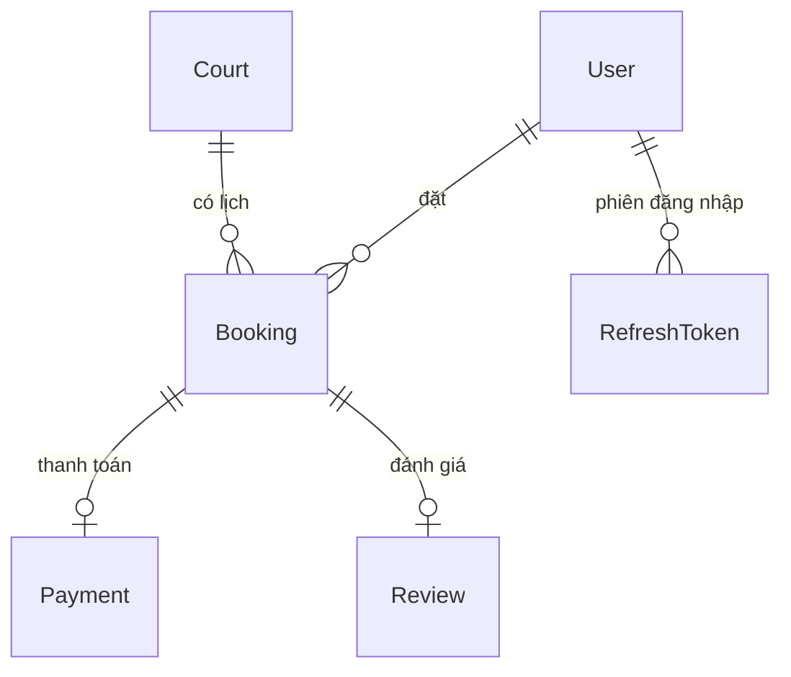

# 🗄️ Kiến Trúc Cơ Sở Dữ Liệu — NOVA Booking

Tài liệu này mô tả chi tiết cấu trúc Database PostgreSQL thực tế đang vận hành trong hệ thống **NOVA Booking**.

---

## 🏗️ 1. Sơ Đồ Thực Thể (ERD)

Dữ liệu được tổ chức để tối ưu hóa việc truy vấn lịch sân và quản lý phiên đăng nhập bảo mật.

---

## 📊 2. Chi Tiết Các Bảng Chính

### 2.1. Bảng `Booking` (Lịch đặt sân)
Đây là bảng có tần suất truy vấn cao nhất. 

- **Cấu trúc đặc biệt**: 
  - `payosOrderCode`: Lưu dưới dạng `BigInt` để tương thích hoàn toàn với mã đơn hàng của PayOS.
  - `status`: Quản lý vòng đời đơn (PENDING -> CONFIRMED -> COMPLETED/CANCELLED).
- **Chiến lược Index**:
  - `@@index([courtId, bookingDate, startTime])`: Đây là index quan trọng nhất để kiểm tra slot trống và hiển thị lịch sân.
  - `@@index([payosOrderCode])`: Tăng tốc độ xác nhận đơn khi nhận Webhook từ PayOS.
  - **Lưu ý**: Chúng tôi KHÔNG sử dụng `@@unique` cho slot để cho phép lưu trữ lịch sử các đơn đã hủy (`CANCELLED`) mà không làm nghẽn việc đặt mới.

### 2.2. Bảng `RefreshToken` (Bảo mật phiên)
- Lưu trữ các token làm mới đã được hash. 
- Hỗ trợ tính năng đăng xuất từ xa và tự động thu hồi quyền truy cập khi hết hạn.

### 2.3. Bảng `Court` (Thông tin sân)
- `avgRating` & `reviewCount`: Được cập nhật tự động mỗi khi có Review mới để tăng tốc độ hiển thị danh sách sân mà không cần tính toán lại.
- `images`: Lưu mảng các URL hình ảnh từ Cloudinary.

---

## ⚡ 3. Cơ Chế Toàn Vẹn Dữ Liệu

1. **Prisma Transactions**: Mọi thao tác Webhook (Cập nhật đơn hàng + Ghi nhận thanh toán) được thực hiện trong một Transaction duy nhất. Nếu một trong hai bước lỗi, toàn bộ sẽ bị hủy để tránh dữ liệu mồ côi.
2. **Timestamptz**: Toàn bộ các trường thời gian (`createdAt`, `updatedAt`, `expiresAt`) đều sử dụng kiểu `Timestamptz(3)` để đảm bảo nhất quán múi giờ giữa máy chủ Render (UTC) và người dùng Việt Nam (ICT).

---

## 📈 4. Logic Thống Kê Dashboard

Hệ thống tính toán trực tiếp từ Database các chỉ số:
- **Doanh thu thực**: Tổng `totalPrice` của các đơn có `paymentStatus = PAID`.
- **Tỷ lệ lấp đầy**: Số slot đã đặt trên tổng số slot mở cửa của sân.
- **Khách hàng thân thiết**: Dựa trên số lượng đơn `COMPLETED` của từng `userId`.

---
*Tài liệu được cập nhật dựa trên Schema thực tế ngày: 16/05/2026*
